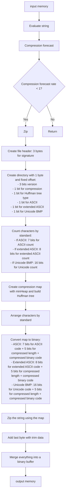
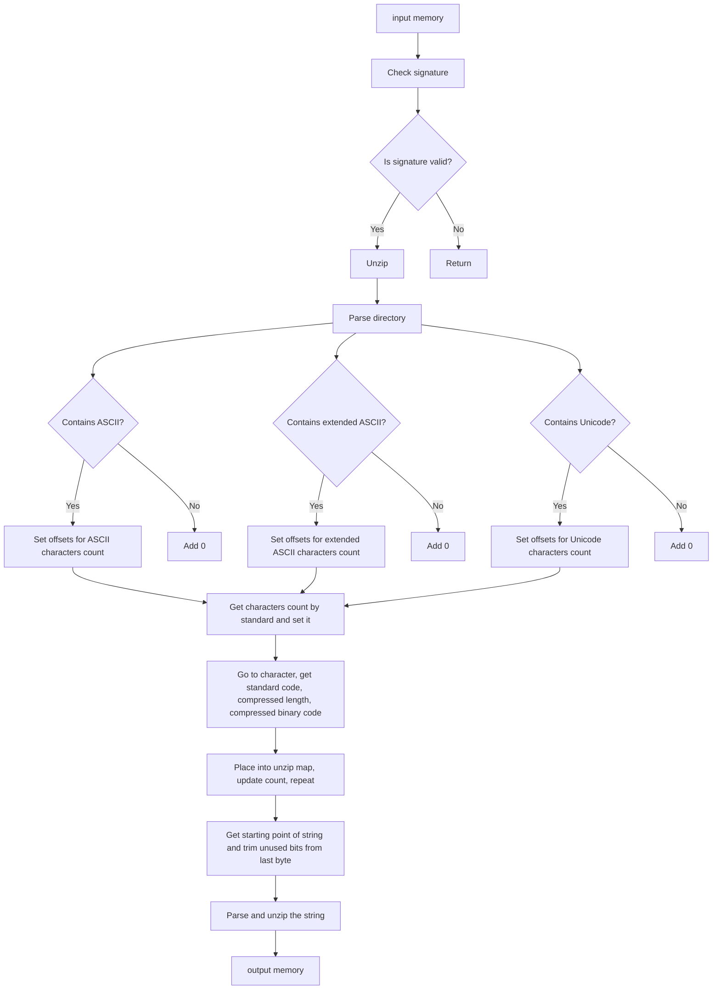

```mermaid
flowchart TD
    A[memoria de entrada] --> B[Evaluar cadena]
    B --> C[Pronóstico de compresión]
    C --> D{Pronóstico de compresión < 1}
    D -- Sí --> E[Comprimir]
    D -- No --> F[Devolver]

    E --> G[Crear encabezado de archivo: 3 bytes para la firma]
    G --> H[Crear directorio de 1 byte con el offset fijo:
    - 3 bits para versión
    - 1 bit para compresión
    - 1 bit para tipo de árbol Huffman
    - 1 bit para ASCII
    - 1 bit para ASCII extendido
    - 1 bit para Unicode BMP]
    H --> I[Contar caracteres por estándar:
    - Si ASCII: 7 bits para cantidad de caracteres ASCII
    - Si ASCII extendido: 8 bits para cantidad de caracteres ASCII extendidos
    - Si Unicode BMP: 16 bits para cantidad de caracteres Unicode]

    I --> J[Crear mapa de compresión con minHeap y construir el árbol Huffman]
    J --> K[Ordenar los caracteres por estándar]
    K --> L[Convertir el mapa a binario:
    - ASCII: 7 bits para el código ASCII + 5 bits para longitud comprimida + código binario comprimido
    - ASCII extendido: 8 bits para el código ASCII extendido + 5 bits para longitud comprimida + código binario comprimido
    - Unicode BMP: 16 bits para el código Unicode + 5 bits para longitud comprimida + código binario comprimido]

    L --> M[Comprimir la cadena usando el mapa]
    M --> N[Agregar el último byte con los datos de recorte]
    N --> O[Fusionar todo en un buffer binario]
    O --> P[memoria de salida]
```

# THE FILEMAKERRRR

[English](#english) | [Español](#español)

## TL;DR

### EN

Comprime y descomprime rápidamente cadenas y archivos de texto desde el navegador. Emplea la codificacion Huffman, con una interfase sencilla y soporte de para Unicode BMP(Basic Multilingual Plane). Descarga desde NPM y listo.

#### Quick Start

SUPA-F\*CKING-FAST!!! (Descarga automaticamente el archivo con el texto comprimido)

```javascript
import { Filemakerrrr } from 'filemakerrrr';
const zipper = new Filemakerrrr({}, myString);
```

### ES

Crea archivos, comprime y descomprime rápidamente cadenas de texto desde el navegador. Emplea la codificacion Huffman en operaciones asíncronas que no bloquean el tiempo de ejecución, con una interfase sencilla y soporte de para Unicode BMP(Basic Multilingual Plane). Descarga desde NPM y listo.

#### Inicio Rápido

SUPA-F\*CKING-FAST!!! (descarga automáticamente el archivo de texto comprimido)

```javascript
import { Filemakerrrr } from 'filemakerrrr';
const zipper = new Filemakerrrr({}, miCadena);
```

## English

Filemakerrrr is a simple and straightforward JavaScript library for parsing files, compressing, decompressing, and downloading strings in the browser.

### Features

-   Fast compression and decompression of text strings and files
-   Uses Huffman coding for efficient compression
-   Asynchronous operations to avoid blocking execution time
-   Simple interface
-   Support for Unicode BMP (Basic Multilingual Plane)
-   Customizable communication method

### Installation

```bash
npm install filemakerrrr
```

### Usage

```javascript
import { Filemakerrrr } from 'filemakerrrr';
const zipper = new Filemakerrrr();

zipper.stringToZip(myString);
zipper.zip();
zipper.download('MyFileName');
```

### Configuration

You can configure Filemakerrrr using an initialization object or methods during code execution:

#### Initialization Object

```javascript
const zipper = new Filemakerrrr({
    downloadName: 'Your File name', // String
    alwaysZip: true, // Boolean
    verbose: true, // Boolean
    talkToMeCallback: myFunction, // Callback, must take a string as a parameter
    lang: 'en', // String with the international code for the language
});
```

Default configuration: FAST(But not SUPA-F\*CKING-FAST)

```javascript
{
    downloadName: 'myFile',
    alwaysZip: false,
    verbose: false,
    talkToMeCallback: console.log,
    lang: 'en',
}
```

#### Methods

-   `stringToZip(string)`: Takes the string to be zipped and stores it in the input memory of the class
-   `parseFile(file)`: Takes the file from the input field, parses it, and stores it in the input memory of the class
-   `zip()`: Zips the string stored in the input memory and stores the result in the output memory of the class
-   `forceIt(alwaysZip)`: Takes a boolean; if true, forces the compression even if Filemakerrrr doesn't recommend it. If no parameter is provided, it defaults to true
-   `unzip()`: Unzips the data stored in the input memory and stores the result in the output memory of the class
-   `download(fileName)`: Downloads the data stored in the output memory of the class. Takes a string as a parameter and uses it to name the file. The file extension is '.txt' if the file is not zipped or '.f4r' if it is
-   `talkToMe(verbose)`: Takes a boolean; if true, all messages are available for the callback. If no parameter is provided, it defaults to true
-   `addListener(callback)`: Takes a callback to execute every time Filemakerrrr has a message for the user. The callback must accept a string as a parameter
-   `flush()`: Clear all stored data
-   `viewStats`: Get compression/decompression stats
-   `flushStats()`: Clear all stats
-   `input`: Get the stored in memory input data
-   `output`: Get the stored in memory output data

### How It Works

Filemakerrrr uses Huffman coding to compress strings efficiently. It evaluates the input, forecasts compression rates, and decides whether to compress based on the potential savings.

#### zipping



#### unzipping



#### Zip forecast

Since not all strings compress equally, and the benefits of compression are only noticeable when there is a certain level of character repetition in sufficiently long strings, Filemakerrrr performs an approximate calculation to determine whether compression is worth it, without consuming excessive computational resources. It estimates the expected compression in the worst-case scenario, where all characters have the same frequency of repetition, creating a balanced tree with all leaves at the same level. If the forecasted compressed file is smaller than or equal to the uncompressed size, compression is performed.

## Español

Filemakerrrr es una biblioteca de JavaScript simple y directa para analizar archivos, comprimir, descomprimir y descargar cadenas de texto en el navegador.

### Características

-   Compresión y descompresión rápida de cadenas de texto y archivos
-   Utiliza codificación Huffman para una compresión eficiente
-   Operaciones asíncronas para evitar bloquear el tiempo de ejecución
-   Interfaz sencilla
-   Soporte para Unicode BMP (Plano Multilingüe Básico)
-   Método personalizable para la comunicación con el usuario

### Instalación

```bash
npm install filemakerrrr
```

Uso estándar: FAST(But not SUPA-F\*CKING-FAST)

```javascript
import { Filemakerrrr } from 'filemakerrrr';
const zipper = new Filemakerrrr();

zipper.stringToZip(miCadena);
zipper.zip();
zipper.download('MiNombreDeArchivo');
```

### Configuración

Puedes configurar Filemakerrrr usando un objeto de inicialización o métodos durante la ejecución del código:

#### Objeto de Inicialización

```javascript
const zipper = new Filemakerrrr({
    downloadName: 'Nombre de tu archivo', // String
    alwaysZip: true, // Boolean
    verbose: true, // Boolean
    talkToMeCallback: miFuncion, // Callback, debe aceptar un string como parámetro
    lang: 'es', // String con el código internacional del idioma
});
```

Configuración predeterminada:

```javascript
{
    downloadName: 'miArchivo',
    alwaysZip: false,
    verbose: false,
    talkToMeCallback: console.log,
    lang: 'es',
}
```

#### Métodos

-   `stringToZip(string)`: Toma la cadena a comprimir y la almacena en la memoria de entrada de la clase
-   `parseFile(file)`: Toma el archivo del campo de entrada, lo analiza y lo almacena en la memoria de entrada de la clase
-   `zip()`: Comprime la cadena almacenada en la memoria de entrada y guarda el resultado en la memoria de salida de la clase
-   `forceIt(alwaysZip)`: Recibe un booleano; si es verdadero, fuerza la compresión incluso si Filemakerrrr no lo recomienda. Si no se proporciona un parámetro, se establece como verdadero
-   `unzip()`: Descomprime los datos almacenados en la memoria de entrada y guarda el resultado en la memoria de salida de la clase
-   `download(fileName)`: Descarga los datos almacenados en la memoria de salida de la clase. Recibe una cadena como parámetro y la utiliza para nombrar el archivo. La extensión del archivo es '.txt' si no está comprimido o '.f4r' si lo está
-   `talkToMe(verbose)`: Recibe un booleano; si es verdadero, todos los mensajes están disponibles para el callback. Si no se proporciona un parámetro, se establece como verdadero
-   `addListener(callback)`: Recibe un callback para ejecutar cada vez que Filemakerrrr tiene un mensaje para el usuario. El callback debe aceptar una cadena como parámetro
-   `flush()`: Limpia todos los datos almacenados
-   `viewStats`: Obtiene estadísticas de compresión/descompresión
-   `flushStats()`: Limpia todas las estadísticas
-   `input`: Obtiene los datos de entrada almacenados en memoria
-   `output`: Obtiene los datos de salida almacenados en memoria

### Cómo Funciona

Filemakerrrr es un proyecto rápido con el que quiero facilitar la creación y compresión de archivos de texto personalizados. Utiliza la codificación Huffman para comprimir cadenas de manera eficiente. Evalúa la entrada, pronostica las tasas de compresión y decide si comprimir en función de los posibles ahorros.

#### zipping



#### unzipping

```mermaid
flowchart TD
    A[memoria de entrada] --> B[Verificar firma]
    B --> C{Firma válida (f4r)}
    C -- Sí --> D[Descomprimir]
    C -- No --> E[Devolver]

    D --> F[Analizar directorio]
    F --> G{ASCII}
    G -- Sí --> H[Establecer desplazamientos para conteo de caracteres ASCII]
    G -- No --> I

    F --> J{ASCII extendido}
    J -- Sí --> K[Establecer desplazamientos para conteo de caracteres ASCII extendidos]
    J -- No --> L

    F --> M{Unicode}
    M -- Sí --> N[Establecer desplazamientos para conteo de caracteres Unicode]
    N --> O[Obtener cantidad de caracteres por estándar y configurarlos]

    O --> P[Ir al carácter, obtener código estándar, longitud comprimida, código binario comprimido]
    P --> Q[Colocar en el mapa de descompresión, actualizar conteo, repetir]
    Q --> R[Obtener punto de inicio de la cadena y recortar bits no utilizados del último byte]
    R --> S[Analizar y descomprimir la cadena]
    S --> T[memoria de salida]
```

#### Pronóstico de compresión

Dado que no todas las cadenas se comprimen de la misma manera y los beneficios de la compresión solo se notan cuando hay cierto nivel de repetición en cadenas lo suficientemente largas, Filemakerrrr realiza un cálculo aproximado para determinar si es conveniente comprimir o no, evitando así un alto consumo de recursos computacionales. Para ello, estima la compresión esperada en el peor escenario posible: cuando todos los caracteres se repiten con la misma frecuencia, creando un árbol balanceado donde todas las hojas están al mismo nivel. Si el pronóstico de tamaño del archivo comprimido resulta ser igual o más pequeño que el original, se procede con la compresión.
